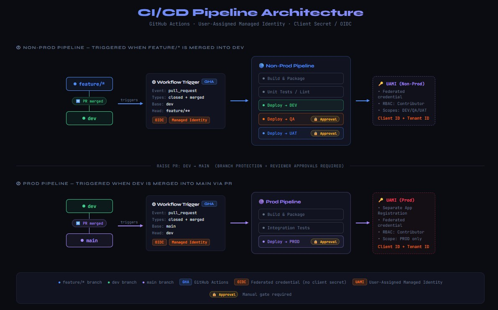

# Terraform POC — Azure with GitHub Actions CI/CD

Terraform on Azure, deployed via GitHub Actions using **UAMI OIDC federated credentials** — no secrets, no App Registration, no client certificates.

---

## Architecture



---

## CI/CD Pipeline

| Branch | Trigger | Pipeline | Deploy target |
|---|---|---|---|
| `feature/*` | push / PR into `dev` | terraform-nonprod.yml | DEV (with approval) |
| `dev` | push | terraform-nonprod.yml | DEV (with approval) |
| `prod` | merge from `dev` | terraform-prod.yml | PROD (with approval) |

Authentication: GitHub Actions → Azure via **UAMI OIDC** (no client secret).
Full setup guide: [docs/github-actions-setup.md](docs/github-actions-setup.md)

---

## Table of Contents

1. [Variable Types](#1-variable-types)
2. [Locals](#2-locals)
3. [Variable Files & Priority Order](#3-variable-files--priority-order)
4. [Sensitive Variables & Environment Vars](#4-sensitive-variables--environment-vars)
5. [Validation](#5-validation)
6. [Loops — count, for_each, conditional](#6-loops--count-for_each-conditional)
7. [Modules](#7-modules)
8. [Outputs](#8-outputs)
9. [Quick Command Reference](#9-quick-command-reference)

---

## 1. Variable Types

Defined in [variables.tf](variables.tf). Terraform supports these primitive and complex types:

### `string`
Plain text. Most common type.
```hcl
variable "application_name" {
  type = string
}
```
Value in `terraform.tfvars`:
```hcl
application_name = "first"
```

---

### `number`
Integer or float.
```hcl
variable "instance_count" {
  type = number
}
```
Value:
```hcl
instance_count = 7
```

---

### `bool`
`true` or `false`. Used for feature flags and conditional resource creation.
```hcl
variable "enabled" {
  type = bool
}
```
Value:
```hcl
enabled = false
```

---

### `list(string)`
Ordered collection. Duplicates are allowed. Access by index (zero-based).
```hcl
variable "regions" {
  type = list(string)
}
```
Value:
```hcl
regions = ["westus", "eastus", "westus"]   # duplicates allowed
```
Access in code:
```hcl
var.regions[0]   # → "westus"
```

---

### `set(string)`
Like a list but **no duplicates, no guaranteed order**. Good for unique keys.
```hcl
variable "region_set" {
  type = set(string)
}
```
Value:
```hcl
region_set = ["westus", "eastus"]
```
> If you passed `["westus", "eastus", "westus"]` to a set, the duplicate would be silently dropped.

---

### `map(string)`
Key-value pairs. Access by key.
```hcl
variable "region_instance_count" {
  type = map(string)
}
```
Value:
```hcl
region_instance_count = {
  "westus" = 4
  "eastus" = 8
}
```
Access in code:
```hcl
var.region_instance_count["westus"]           # → 4
var.region_instance_count[var.regions[0]]     # dynamic key lookup
```

---

### `object`
Structured type — like a typed map. Each key has its own type.
```hcl
variable "sku_settings" {
  type = object({
    kind = string
    tier = string
  })
}
```
Value:
```hcl
sku_settings = {
  kind = "P"
  tier = "Business"
}
```
Access:
```hcl
var.sku_settings.kind   # → "P"
var.sku_settings.tier   # → "Business"
```

---

### Type Comparison Summary

| Type          | Ordered | Duplicates | Access by    | Example value                        |
|---------------|---------|------------|--------------|--------------------------------------|
| `string`      | —       | —          | —            | `"westus"`                           |
| `number`      | —       | —          | —            | `7`                                  |
| `bool`        | —       | —          | —            | `true`                               |
| `list(T)`     | Yes     | Yes        | Index `[0]`  | `["westus", "eastus"]`               |
| `set(T)`      | No      | No         | iteration    | `["westus", "eastus"]`               |
| `map(T)`      | No      | No (keys)  | Key `["k"]`  | `{ westus = 4 }`                     |
| `object({…})` | No      | —          | Attr `.kind` | `{ kind = "P", tier = "Business" }`  |

---

## 2. Locals

Locals are **computed values** that exist only within the root module. They are not inputs — you can't set them from outside. Defined in `main.tf`:

```hcl
locals {
  environment_prefix = "${var.application_name}-${var.environment_name}-${random_string.suffix.result}"
}
```

Also used inside validation:
```hcl
# variables.tf uses local.min_nodes and local.max_nodes
condition = var.instance_count >= local.min_nodes && var.instance_count <= local.max_nodes
```

**When to use locals vs variables:**

| Use case                              | Use        |
|---------------------------------------|------------|
| Value comes from outside (user/env)   | `variable` |
| Value computed from other values      | `local`    |
| Value used in multiple places         | `local`    |
| Value that should never be overridden | `local`    |

---

## 3. Variable Files & Priority Order

Terraform loads variable values from multiple sources. **Later sources win** (higher number = higher priority):

```
Priority (lowest → highest)
──────────────────────────────────────────────────────────────
1. Default value inside variable block (variables.tf)
2. terraform.tfvars            (auto-loaded)
3. *.auto.tfvars               (auto-loaded, alphabetical order)
4. -var-file flag              (explicit, e.g. -var-file ./env/prod.tfvars)
5. -var flag                   (inline on CLI, e.g. -var "name=value")
6. TF_VAR_<name> env variable  (highest priority)
──────────────────────────────────────────────────────────────
```

### Files in this lab

```
lab1/
├── terraform.tfvars          # auto-loaded — sets application_name = "first"
├── default.auto.tfvars       # auto-loaded — also sets application_name = "first"
├── env/
│   ├── dev.tfvars            # NOT auto-loaded — must pass with -var-file
│   ├── test.tfvars           # NOT auto-loaded
│   └── prod.tfvars           # NOT auto-loaded
```

### How to use per-environment files

```powershell
# Plan against dev
terraform plan -var-file ./env/dev.tfvars

# Plan against prod
terraform plan -var-file ./env/prod.tfvars

# Override a single value on top of a file
terraform plan -var-file ./env/dev.tfvars -var "instance_count=9"
```

### What each env file overrides

| Variable            | dev.tfvars  | test.tfvars | prod.tfvars |
|---------------------|-------------|-------------|-------------|
| `environment_name`  | `"dev"`     | `"test"`    | `"prod"`    |
| `instance_count`    | `7`         | `7`         | `4`         |
| `enabled`           | `false`     | `false`     | `false`     |

---

## 4. Sensitive Variables & Environment Vars

Mark a variable `sensitive = true` so Terraform **never prints its value** in plan/apply output or state display:

```hcl
variable "api_key" {
  type      = string
  sensitive = true
}
```

Outputs that use sensitive variables must also be marked sensitive:
```hcl
output "api_key" {
  value     = "${var.api_key}bar"
  sensitive = true      # required when value contains a sensitive var
}
```

### Passing sensitive values without putting them in a file

Use an environment variable — Terraform reads `TF_VAR_<variable_name>` automatically:

```powershell
# PowerShell (Windows)
$env:TF_VAR_api_key = "foo"

# Then run plan/apply — no -var needed
terraform apply -var-file ./env/dev.tfvars
```

```bash
# Bash (Linux/Mac)
export TF_VAR_api_key=foo
```

This keeps secrets out of `.tfvars` files and version control.

---

## 5. Validation

Validation blocks run **before** Terraform contacts any provider. They catch bad input early.

```hcl
variable "application_name" {
  type = string

  validation {
    condition     = length(var.application_name) <= 12
    error_message = "Application Name must be less than or equal to 12 characters"
  }
}
```

```hcl
variable "instance_count" {
  type = number

  validation {
    condition     = var.instance_count >= local.min_nodes &&
                    var.instance_count <= local.max_nodes &&
                    var.instance_count % 2 != 0
    error_message = "Must be between 5 and 9 and never even!"
  }
}
```

The second example shows:
- Range check (`>= min && <= max`)
- Parity check (`% 2 != 0` → must be odd)
- Referencing a `local` inside a validation condition

---

## 6. Loops — count, for_each, conditional

### `count` — repeat N times (list-based)

Creates multiple instances of a resource. Each instance is addressed by index.

```hcl
resource "random_string" "list" {
  count = length(var.regions)   # var.regions has 3 items → creates 3 resources

  length  = 6
  upper   = false
  special = false
}
```

Access individual instances:
```hcl
random_string.list[0].result   # first region's string
random_string.list[1].result   # second
```

**Problem with `count`:** if you remove an item from the middle of a list, Terraform re-indexes everything after it, causing unnecessary destroy/create cycles.

---

### `for_each` — iterate a map or set (key-based)

Each instance is addressed by key, not index. Safer than `count` for most real workloads.

```hcl
resource "random_string" "map" {
  for_each = var.region_instance_count   # map: { westus=4, eastus=8 }

  length  = 6
  upper   = false
  special = false
}
```

Access individual instances:
```hcl
random_string.map["westus"].result
random_string.map["eastus"].result
```

Inside the resource body you can access the current iteration:
```hcl
each.key    # → "westus" or "eastus"
each.value  # → 4 or 8
```

**`for_each` vs `count`:**

| Scenario                          | Use        |
|-----------------------------------|------------|
| Fixed count (e.g. "3 replicas")   | `count`    |
| Iterating a map or set of items   | `for_each` |
| Items have meaningful unique keys | `for_each` |
| Order matters, items are uniform  | `count`    |

---

### Conditional count — create 0 or 1 resource

The ternary operator `condition ? true_value : false_value` is commonly used with `count` as an on/off switch:

```hcl
resource "random_string" "if" {
  count = var.enabled ? 1 : 0   # create only when enabled = true

  length  = 6
  upper   = false
  special = false
}
```

- `var.enabled = true`  → `count = 1` → resource exists
- `var.enabled = false` → `count = 0` → resource does not exist

When using such a resource elsewhere:
```hcl
# Must guard access with a conditional because the list may be empty
random_string.if[0].result   # only safe when enabled = true
```

---

## 7. Modules

Modules package reusable Terraform code. There are two kinds used in this lab.

### Registry modules (remote)

Pulled from the [Terraform Registry](https://registry.terraform.io). Versioned.

```hcl
module "alpha" {
  source  = "hashicorp/module/random"   # <namespace>/<module>/<provider>
  version = "1.0.0"
}

module "bravo" {
  source  = "hashicorp/module/random"
  version = "1.0.0"
}
```

- Two separate module instances, same source
- Each gets its own isolated state
- `terraform init` downloads them into `.terraform/`

---

### Local modules (path-based)

Stored in your repo under `./modules/`. No version pinning — they change when you change the files.

```hcl
module "charlie" {
  source = "./modules/rando"   # relative path
  length = 8                   # passing a variable to the module
}
```

The module at [modules/rando/](modules/rando/):

**modules/rando/variables.tf** — declares what the module accepts:
```hcl
variable "length" {
  type = number
}
```

**modules/rando/main.tf** — the module's resources:
```hcl
resource "random_string" "rando" {
  length  = 6        # note: this ignores the length variable — a bug in the lab
  upper   = false
  special = false
}
```

**modules/rando/outputs.tf** — what the module exposes to the caller:
```hcl
output "random_string" {
  value = random_string.rando.result
}
```

Caller reads the output as:
```hcl
module.charlie.random_string
```

### Module structure mental model

```
Root module (main.tf)
│
├── calls → module "alpha"   (registry: hashicorp/module/random)
├── calls → module "bravo"   (registry: hashicorp/module/random)
└── calls → module "charlie" (local: ./modules/rando)
                │
                └── creates → random_string.rando
                └── exposes → output "random_string"
```

### When to use modules

| Scenario                              | Create a module? |
|---------------------------------------|-----------------|
| Same resource pattern in 3+ places    | Yes             |
| Environment-specific config only      | No — use tfvars |
| Shared infra used by multiple teams   | Yes             |
| Single resource, used once            | No              |

---

## 8. Outputs

Outputs print values after apply and let modules expose data to their callers.

```hcl
output "application_name" {
  value = var.application_name
}

output "environment_prefix" {
  value = local.environment_prefix      # using a local
}

output "primary_region" {
  value = var.regions[0]                # index into a list
}

output "primary_region_instance" {
  value = var.region_instance_count[var.regions[0]]   # dynamic map lookup
}

output "kind" {
  value = var.sku_settings.kind         # object attribute
}

output "charlie" {
  value = module.charlie.random_string  # module output
}
```

Read a specific output after apply:
```powershell
terraform output application_name
terraform output environment_prefix
```

---

## 9. Quick Command Reference

```powershell
# Initialize — download providers and modules
terraform init

# Preview changes (dry run)
terraform plan

# Plan with specific env file
terraform plan -var-file ./env/dev.tfvars

# Plan with inline variable override
terraform plan -var "application_name=myapp" -var "environment_name=dev"

# Apply changes
terraform apply
terraform apply -var-file ./env/prod.tfvars

# Read a specific output
terraform output application_name

# Destroy all resources
terraform destroy

# Set sensitive var via environment (PowerShell)
$env:TF_VAR_api_key = "mysecret"
```

---

## Key Concepts at a Glance

```
variables.tf      → DECLARE variables (name, type, validation)
terraform.tfvars  → SET variable values (auto-loaded)
*.auto.tfvars     → SET variable values (auto-loaded)
env/*.tfvars      → SET environment-specific values (manual -var-file)
TF_VAR_*          → SET via shell env (highest priority, good for secrets)
locals {}         → COMPUTE intermediate values (not settable from outside)
outputs.tf        → EXPOSE values after apply, or between modules
modules/          → PACKAGE reusable resource groups
```
